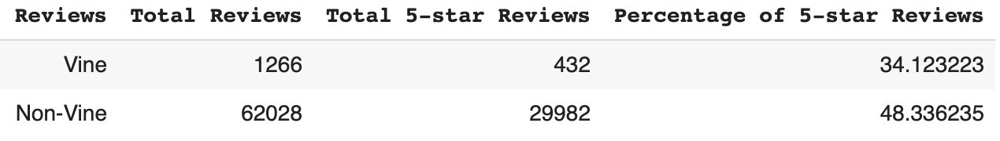

# Amazon_Vine_Analysis

## Purpose
The purpose of this analysis was to determine if Vine reviews presented a positivity bias. To measure such bias, this analysis compared the percentage of Vine and non-Vine 5-star reviews from the Toys US Reviews Dataset: https://s3.amazonaws.com/amazon-reviews-pds/tsv/amazon_reviews_us_Toys_v1_00.tsv.gz. 

## Results
Results are as follows: 
1. A total of 1,266 Vine reviews and 62,028 non-Vine reviews were in the dataset.
2. A total of 432 5-star Vine reviews and 29,982 non-Vine reviews were in the dataset. 
3. The percentage of 5-star Vine reviews was 34%, and the percentage of 5-star non-Vine reviews was 48%. 

## Summary
Based on the results, there is no positivity bias for reviews in the Vine program. The fact that the percentage of 5-star Vine reviews was 14 percentage points less than the percentage of 5-star non-Vine reviews may even represent a negativity bias for reviews in the Vine program. However, the total number of non-Vine reviews in the dataset was 49 times larger than the total number of Vine reviews in the dataset. Therefore, we would need to increase the volume of Vine reviews in the dataset and rerun this analysis to further evaluate. Additionally, we could use Natural Language Processing (NLP) to compare the percentage of positive sentiment in the written comments of 5-star Vine and non-Vine reviews to further support the findings. 
